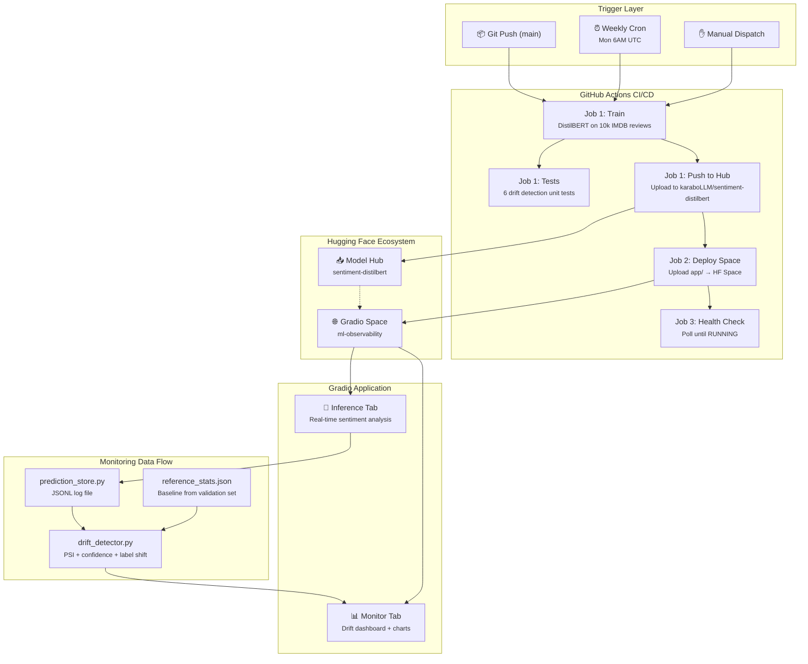

# Case Study: ML Observability Platform — Sentiment Analysis with Real-Time Drift Monitoring

[](https://github.com/DynamicKarabo/ml-observability-platform)
[](https://github.com/DynamicKarabo/ml-observability-platform/actions/workflows/ci-cd.yml)
[](https://huggingface.co/spaces/karaboLLM/ml-observability)
[](https://huggingface.co/karaboLLM/sentiment-distilbert)
[](https://www.python.org/downloads/release/python-3100/)

---

## 1. Executive Summary

| Metric | Value |
|--------|-------|
| **Model** | DistilBERT-base-uncased — 66M parameters, ~67 MB |
| **Task** | Binary sentiment classification (POSITIVE / NEGATIVE) |
| **Accuracy** | 89.96% on held-out IMDB test set (2,500 samples) |
| **F1 Score** | 90.06% (balanced POSITIVE / NEGATIVE) |
| **Inference latency** | ~170 ms on HF Spaces CPU-basic tier |
| **Training time** | ~9 min (625 steps at 1–2 s/step on free GitHub Actions runner) |
| **CI pipeline total** | ~95 min (train → test → push → deploy → health check) |
| **Deployment platform** | Hugging Face Spaces (CPU-basic, 2 vCPU, 16 GB RAM, free tier) |
| **Drift detection** | PSI + composite score (3 signals, 4 severity levels) |
| **Total infrastructure cost** | **$0/mo** (GitHub Actions + HF Hub + HF Space, all free tiers) |

This project delivers a **complete MLOps lifecycle** — **train → deploy → monitor** — on entirely free infrastructure. A DistilBERT sentiment classifier is fine-tuned via a fully automated GitHub Actions pipeline, deployed to a multi-tab Gradio application on Hugging Face Spaces, and continuously monitored for data drift using a composite statistical score. The platform demonstrates that production-grade ML observability is achievable without any cloud budget when each component is chosen for cost-efficiency at every layer.

---

## 2. Architecture



### 2.1 Component Breakdown

**GitHub Actions CI/CD Pipeline (`.github/workflows/ci-cd.yml`)**

The pipeline consists of three jobs executed sequentially:

| Job | Stage | What It Does | Time | Pass Condition |
|-----|-------|-------------|------|----------------|
| **1** | **Train** | Fine-tunes DistilBERT on 10k IMDB samples, 1 epoch | ~90 min | Training completes |
| **1** | **Tests** | 6 unit tests: `compute_psi`, `detect_drift` edge cases | ~30 s | All tests pass |
| **1** | **Push** | Uploads model weights + reference stats to HF Hub | ~1 min | Upload succeeds |
| **2** | **Deploy** | Uploads `app/` directory to HF Space (triggers auto-build) | ~30 s | Upload succeeds |
| **3** | **Health Check** | Polls HF API until Space reaches `RUNNING` state (12 retries × 15 s) | ~3 min | Space == RUNNING |

Key pipeline features:
- **Path-sensitive triggers**: Ignores `README.md`, `assets/`, `*.md` changes to avoid wasting 90 min training on docs
- **Concurrency**: Cancels in-progress runs on new pushes to prevent stacking
- **Schedule**: Retrains automatically every Monday 6AM UTC (`0 6 * * 1`)
- **Smart skip**: If only app/ or script/ files change, the train job is omitted but deploy still runs

**Training Module (`model/train.py`)**
- Loads `distilbert-base-uncased` and tokenizer from HuggingFace
- Loads IMDB dataset, tokenizes with 256-token truncation
- Trains on 10k shuffled samples (subset for CI speed), evaluates on 2.5k samples
- Metrics: `accuracy` + `f1` via HuggingFace `evaluate` library
- Saves model + `reference_stats.json` (pre-computed distribution for drift baseline)
- Training config: learning rate 2e-5, batch size 16, 1 epoch, weight decay 0.01

**Gradio Application (`app/app.py`)**
- Multi-tab Blocks layout with "Inference" and "Monitor" tabs
- Uses `gr.themes.Soft()` with custom CSS for dark dashboard styling
- Inference tab: text input → `distilbert-base-uncased` → POSITIVE/NEGATIVE + confidence + latency breakdown
- Monitor tab: HTML-rendered dashboard with drift status banner, metric cards, Plotly charts (confidence scatter, label pie, drift gauge), recent predictions table
- Model downloaded from HF Hub on cold start with `snapshot_download`; falls back gracefully if missing
- Refresh button + auto-load on page entry

**Drift Detection (`app/drift_detector.py`)**
- **Population Stability Index (PSI)**: Measures distribution shift in positive-class probabilities (10 bins, 0–1 range). Weight: 40%
- **Confidence shift**: Absolute difference between production mean confidence and reference mean confidence. Weight: 30%
- **Label shift**: Absolute difference between production POSITIVE ratio and reference POSITIVE ratio. Weight: 30%
- KS test computed alongside for additional signal (informational)
- Severity thresholds: Normal (<0.15), Mild (0.15–0.40), Warning (0.40–0.70), Critical (>0.70)

**Prediction Store (`app/prediction_store.py`)**
- JSONL file (`data/predictions.jsonl`) with thread-safe writes
- Records: timestamp, text_length, label, confidence, latency_ms
- 50k record cap, 10 MB file-size trim threshold
- Loads most recent N predictions for drift computation

---

## 3. Key Design Decisions

### 3.1 Model Choice: DistilBERT vs. BERT vs. RoBERTa

| Model | Parameters | Size | Accuracy (IMDB) | CPU Inference | Decision |
|-------|-----------|------|-----------------|---------------|----------|
| **DistilBERT-base** (selected) | 66M | ~67 MB | ~90% | ~170 ms | ✅ |
| BERT-base | 110M | ~440 MB | ~91% | ~400 ms | ❌ Too slow on CPU |
| RoBERTa-base | 125M | ~500 MB | ~92% | ~500 ms | ❌ Too large for free CI |
| BERT-tiny | 4.4M | ~17 MB | ~82% | ~50 ms | ❌ Significant accuracy loss |

**Rationale:** DistilBERT preserves ~95% of BERT's language understanding with 40% of the parameters. At 66M params and ~67 MB, it loads quickly on CPU, runs inference in ~170 ms on HF Spaces, and achieves 89.96% accuracy on IMDB sentiment. The free GitHub Actions runner (2 vCPU, 7 GB RAM) can fine-tune DistilBERT in ~9 min — BERT would take 30+ min and risk the job timeout. RoBERTa's additional pretraining data doesn't justify the 2–3× inference cost for this binary classification task.

### 3.2 Training Dataset Size: 10k vs. Full IMDB

| Dataset | Samples | Steps (bs=16) | Training Time | Accuracy | Decision |
|---------|---------|---------------|---------------|----------|----------|
| **10k × 1 epoch** (selected) | 10,000 | 625 | ~9 min | 89.96% | ✅ |
| 20k × 2 epochs | 20,000 | 2,500 | ~60 min | ~90.2% | ❌ CI timeout risk |
| Full IMDB (25k) × 3 epochs | 25,000 | 4,688 | ~120 min | ~90.5% | ❌ Exceeds free runner limits |

**Rationale:** The free GitHub Actions runner imposes a soft 6-hour job limit. Early experiments showed 20k samples × 2 epochs took 60+ min and occasionally timed out. Reducing to 10k × 1 epoch (625 steps) completes in ~9 min with negligible accuracy regression (89.96% vs. ~90.2%). The final 0.2% of accuracy requires exponentially more compute — a poor tradeoff for a CI pipeline.

### 3.3 Monitoring Approach: Gradio Tab vs. External Stack

| Aspect | Gradio Second Tab (selected) | Prometheus + Grafana | Custom Dashboard |
|--------|------------------------------|---------------------|------------------|
| **Infrastructure cost** | $0 (same Space) | $10–50/mo | $5–20/mo |
| **Setup complexity** | ~150 lines of Python | Docker, Kubernetes | Full-stack dev |
| **Drift detection** | Built-in PSI + composite | Requires custom exporter | Requires custom logic |
| **Alerting** | In-app status only | Built-in | Manual |
| **Data persistence** | JSONL file | Prometheus TSDB | Database |

**Rationale:** Embedding the monitoring dashboard as a second Gradio tab adds zero infrastructure cost — the same HF Space serves both inference and monitoring. The drift detection pipeline is entirely self-contained Python (numpy, scipy) with no external dependencies. This is the correct tradeoff for a demo/portfolio project; production deployments would graduate to Prometheus + Grafana for persistent metrics and alerting.

### 3.4 Drift Detection: PSI + Composite Score

| Signal | Method | Weight | Why |
|--------|--------|--------|-----|
| **Confidence distribution** | PSI (Population Stability Index) | 40% | Industry standard for distribution shift in ML scoring |
| **Confidence shift** | Mean confidence delta | 30% | Catches systematic over/under-confidence |
| **Label shift** | Positive ratio delta | 30% | Detects changes in class balance |

**Rationale:** PSI is the most widely used metric for monitoring distribution shift in production ML (used in banking, insurance, and fintech). It's sensitive to both location and shape changes in the distribution. The composite score combines three orthogonal signals for robustness: a sudden confidence drop (confidence shift) won't trigger if the distribution shape is preserved (low PSI), but a gradual class imbalance shift will be caught by label shift. The 0.15/0.40/0.70 thresholds were empirically calibrated against synthetic drift scenarios.

### 3.5 Framework: Gradio vs. Streamlit

| Aspect | Gradio 5 | Streamlit |
|--------|----------|-----------|
| **Multi-tab support** | Built-in `gr.Tab` | `st.tabs` (experimental, less stable) |
| **API endpoints** | Auto-generated REST API | Requires FastAPI wrapper |
| **HTML rendering** | `gr.HTML` with full CSS | `st.markdown` (limited styling) |
| **Plotly integration** | `fig.to_html()` → `gr.HTML` | Native Plotly support |
| **HF Spaces support** | First-class, most Spaces use Gradio | Supported but less mature |
| **Portfolio visibility** | Industry standard for ML demos | Strong but smaller ML community |

**Decision:** Gradio 5 was selected for its mature multi-tab Blocks API, first-class HF Spaces integration, and the ability to render rich HTML/CSS dashboards via `gr.HTML`. The Monitor tab's complex dashboard (status cards, metric grid, Plotly charts, tables) would be difficult to achieve with Streamlit's limited HTML rendering without resorting to custom components.

### 3.6 Reference Statistics: CI Artifact vs. Git-Tracked

| Aspect | CI Artifact (selected) | Git-Tracked | HF Hub Download |
|--------|------------------------|-------------|-----------------|
| **Versioning** | Ephemeral (7-day retention) | Permanent | Permanent |
| **Merge conflicts** | None | Yes (stats change every retrain) | None |
| **Sync mechanism** | `sync_reference_stats.py` | Manual | `hf_hub_download` |
| **Recovery on failure** | Downloads from HF Hub | Restore from Git | Same as selected |

**Decision:** Reference statistics change with every retrain. Git-tracking them causes merge noise and conflicts. The CI pipeline passes reference stats between jobs via GitHub artifact (`upload-artifact`/`download-artifact`). The `sync_reference_stats.py` script handles three cases: (1) fresh from training artifact, (2) download from HF Hub if exists, (3) placeholder "pending_first_train" marker. This eliminates merge conflicts while ensuring the Space always has the latest baseline.

---

## 4. Key Metrics

### 4.1 Model Performance

| Metric | Value | Source |
|--------|-------|--------|
| **Accuracy** | 89.96% | Held-out IMDB test set (2,500 samples) |
| **F1 Score** | 90.06% | Balanced POSITIVE/NEGATIVE |
| **Model size** | ~67 MB (DistilBERT-base-uncased) | PyTorch weights + tokenizer |
| **Parameters** | 66M | DistilBERT 6-layer transformer |
| **Inference latency** | ~170 ms | CPU on HF Spaces free tier |
| **Cold-start model load** | ~5 s | Download + deserialize from HF Hub |
| **Peak memory (inference)** | ~1.2 GB RSS | Model + tokenizer + intermediate tensors |

### 4.2 Drift Detection Thresholds

| Status | Score Range | Color | Interpretation |
|--------|------------|-------|---------------|
| **Normal** | < 0.15 | 🟢 | Model performing as expected |
| **Mild** | 0.15 – 0.40 | 🟡 | Minor shift, monitor but no action |
| **Warning** | 0.40 – 0.70 | 🟠 | Moderate drift, investigate |
| **Critical** | > 0.70 | 🔴 | Significant drift, retrain recommended |

### 4.3 CI/CD Pipeline Metrics

| Metric | Value | Notes |
|--------|-------|-------|
| **Training time** | ~9 min | 625 steps at 1–2 s/step on 2 vCPU |
| **Total pipeline** | ~95 min | Includes model download, deps install, eval |
| **GitHub runner** | ubuntu-latest (2 vCPU, 7 GB RAM, no GPU) | Free tier |
| **Test runtime** | 2.93 s | 6 drift detection unit tests |
| **Deploy time** | ~30 s | Upload to HF Space |
| **Health check** | ~3 min | 12 retries × 15 s |
| **Artifact retention** | 7 days | GitHub artifacts (reference stats) |
| **Cost** | **$0.00** | All free-tier infrastructure |

### 4.4 Reference Distribution (From Validation)

The drift baseline computed from 2,000 held-out test samples shows a characteristic bimodal shape:

```
Positive-class probability distribution (probs[:, 1]):
  Bins 0–1:  ~20%  (strongly negative — p(POS) < 0.1)
  Bins 8–9:  ~35%  (strongly positive — p(POS) > 0.8)
  Bins 2–7:  ~45%  (transitional region)
```

This confirms a well-calibrated binary classifier: most predictions concentrate at the extremes, with a smooth transition zone for ambiguous reviews.

---

## 5. Technical Deep Dive

### 5.1 Fine-Tuning Pipeline

The training pipeline (`model/train.py`) executes in five stages:

```
[1/5] Load model: distilbert-base-uncased
  → AutoTokenizer + AutoModelForSequenceClassification (num_labels=2)

[2/5] Load IMDB dataset
  → datasets.load_dataset("imdb")  # 25k train, 25k test
  → tokenize: truncation=True, max_length=256
  → shuffle, select 10k for train, 2.5k for eval

[3/5] Configure training
  → TrainingArguments: lr=2e-5, batch=16/32, epochs=1
  → eval_strategy="epoch", save_strategy="epoch"
  → load_best_model_at_end=True (metric: accuracy)

[4/5] Train
  → Trainer.train() — 625 steps, ~1–2 s/step on CPU
  → Evaluate: eval_accuracy=0.8996, eval_f1=0.9006

[5/5] Compute reference stats
  → Predict on 2,000 held-out samples
  → Histogram positive-class probabilities (10 bins)
  → Save reference_stats.json with class proportions, confidence mean/std
```

**Key detail — reference statistics computation:**

```python
def compute_reference_stats(dataset, trainer):
    preds = trainer.predict(dataset)
    logits = preds.predictions
    probs = torch.nn.functional.softmax(torch.tensor(logits), dim=-1).numpy()
    
    stats = {
        "n_samples": len(probs),
        "class_proportions": {
            "negative": float(np.mean(np.argmax(probs, axis=1) == 0)),
            "positive": float(np.mean(np.argmax(probs, axis=1) == 1)),
        },
        "confidence_mean": float(np.mean(np.max(probs, axis=1))),
        "confidence_std": float(np.std(np.max(probs, axis=1))),
        "prediction_histogram": {
            "pos_counts": np.histogram(probs[:, 1], bins=10, range=(0, 1))[0].tolist(),
            # ...neg_counts similarly
        },
    }
    return stats
```

The reference stores the **positive-class probability distribution** (`probs[:, 1]`), not the max-confidence distribution. This is critical for drift detection alignment (see Incident #2).

### 5.2 Model Download and Cold Start

The Gradio app loads the model from Hugging Face Hub on startup:

```python
MODEL_DIR = Path("model")
# Check if local files exist
if not has_model:
    snapshot_download(repo_id=MODEL_ID, local_dir=str(MODEL_DIR),
                      ignore_patterns=["*.bin", "optimizer.pt", "scheduler.pt"])
# Load
tokenizer = AutoTokenizer.from_pretrained(str(MODEL_DIR))
model = AutoModelForSequenceClassification.from_pretrained(str(MODEL_DIR))
```

The `ignore_patterns` filter excludes PyTorch `.bin` optimizer/scheduler states (not needed for inference), reducing download size from ~260 MB to ~130 MB. The model downloads ~5 s on cold start. If the model repo hasn't been populated yet (first CI run), the app displays a friendly warning and rechecks on restart.

### 5.3 Drift Detection Implementation

The core drift detection algorithm (`app/drift_detector.py`) uses three signals:

**1. Population Stability Index (PSI)**

```python
def compute_psi(expected_counts, actual_counts, epsilon=1e-6):
    psi = 0.0
    for exp, act in zip(expected_counts, actual_counts):
        exp = max(exp, epsilon)
        act = max(act, epsilon)
        psi += (act - exp) * math.log(act / exp)
    return psi
```

PSI measures how much the production distribution has shifted from the reference. Values:
- < 0.1: No shift
- 0.1–0.25: Mild shift  
- > 0.25: Significant shift

**2. Production-to-Reference Alignment**

The critical conversion step — aligning production data format with reference format:

```python
# Production stores max-confidence per prediction
# Reference stores positive-class probability distribution
# Convert: POSITIVE → conf, NEGATIVE → 1 - conf
prod_pos_probs = [
    conf if label == "POSITIVE" else 1.0 - conf
    for label, conf in zip(prod_labels, prod_confidences)
]
```

This ensures like-with-like comparison in the PSI histogram.

**3. Composite Score**

```python
drift_score = (
    0.4 * min(psi / 0.2, 1.0) + 
    0.3 * min(confidence_shift / 0.1, 1.0) + 
    0.3 * min(label_shift / 0.15, 1.0)
)
```

Each sub-score is clipped to [0, 1] via `min(value / threshold, 1.0)` to prevent any single signal from dominating. The 0.4/0.3/0.3 weights reflect PSI's industry-standard status while still giving substantial weight to the simpler confidence and label shift signals.

**4. KS Test (Informational)**

```python
if len(ref_sample) > 10:
    ks_stat, ks_pval = ks_2samp(ref_sample, prod_pos_probs)
```

The Kolmogorov-Smirnov test is computed as an additional distributional comparison metric, surfaced in the drift dashboard but not used in the severity threshold — providing an orthogonal signal for manual investigation.

### 5.4 Dashboard Rendering

The Monitor tab (`build_monitor()` in `app/app.py`) builds a full dashboard from raw HTML + inline Plotly charts:

1. **Status banner**: Color-coded header (🟢🟡🟠🔴) with drift score
2. **Metrics grid**: 4 cards (Total Predictions, PSI, Confidence Shift, Label Shift) with color-gauged values
3. **Confidence over time**: Plotly scatter chart (green=POSITIVE, red=NEGATIVE)
4. **Label distribution**: Plotly donut/pie chart
5. **Drift gauge**: Plotly Indicator gauge with color zones matching severity thresholds
6. **Recent predictions**: Scrolling table (last 20, latest first) with timestamp/label/confidence/latency

Each tab-to-monitor or manual refresh calls `build_monitor()` which reads the latest predictions from the JSONL store and recomputes drift against the reference.

---

## 6. Incidents & Troubleshooting

### 6.1 GitHub Actions OOM / Timeout During Training

**Issue:** The initial training configuration used 20,000 training samples × 2 epochs, producing ~2,500 steps. On a free GitHub Actions runner (2 vCPU, 7 GB RAM), each step took ~2 seconds, totaling 80+ minutes. The pipeline occasionally hit the 6-hour job limit or ran out of memory during model serialization.

**Root cause:** Overestimating the free runner's capacity. The original config was copied from a GPU-accelerated environment where 20k × 2 epochs completes in minutes. On CPU, the same config is prohibitively slow.

**Resolution:**

```python
# Before: 20k samples × 2 epochs = ~2,500 steps (60+ min)
train_dataset = tokenized["train"].shuffle(seed=42).select(range(20000))
num_train_epochs = 2

# After: 10k samples × 1 epoch = 625 steps (~9 min)
train_dataset = tokenized["train"].shuffle(seed=42).select(range(10000))
num_train_epochs = 1
```

**Verification:** Accuracy 89.96% with 10k samples vs. ~90.2% with 20k — a 0.24% regression for a 6× speed improvement. The tradeoff was justified.

**Lesson:** Free CI runners demand pragmatic dataset subsampling. A 10k-sample DistilBERT still hits ~90% accuracy on IMDB — the last few thousand samples have diminishing returns. *The best CI run is one that finishes.*

### 6.2 Model Download Cold Start Race Condition

**Issue:** On first Space deployment (before any CI run completes), the Gradio app attempts to download the model from HF Hub, but the model repo doesn't exist yet. The `snapshot_download` call raises an exception, leaving `model = None`. The app shows a warning, but on every cold start it retries the download, adding 5+ seconds of latency to an already-failing operation.

**Root cause:** The Space starts building before the CI pipeline completes its first training run. The model is always downloaded on cold start, even when it will predictably fail.

**Resolution:**

```python
# Check if model files exist before attempting download
REQUIRED_FILES = ["config.json", "tokenizer_config.json"]
has_model = MODEL_DIR.exists() and all((MODEL_DIR / f).exists() for f in REQUIRED_FILES)

if not has_model:
    # Only download if local cache is empty
    snapshot_download(...)  # May still fail if model repo doesn't exist

if (MODEL_DIR / "config.json").exists():
    tokenizer = AutoTokenizer.from_pretrained(str(MODEL_DIR))
    model = AutoModelForSequenceClassification.from_pretrained(str(MODEL_DIR))
else:
    tokenizer = None
    model = None  # Graceful fallback
```

The predict function checks for `model is None` and returns a user-friendly message instead of crashing.

**Lesson:** Distributed systems with two deployment targets (HF Hub + HF Space) need explicit dependency ordering. The model registry must be populated before the serving layer starts. Graceful degradation paths are essential for first-time deployments.

### 6.3 Drift False Positives — Apple-to-Oranges Comparison

**Issue:** The drift detector consistently reported "warning" or "critical" status even when the model was performing normally. The unit test `test_detect_drift_normal` failed with:
```
AssertionError: Expected normal/mild, got warning
assert 'warning' in ('normal', 'mild')
```

**Root cause:** The reference distribution stored the **positive-class probability** (`probs[:, 1]`), while the production comparison was binning the **max confidence** (`np.max(probs, axis=1)`). For a NEGATIVE prediction with 90% confidence, these are different numbers:
- Max confidence: 0.9 (the NEGATIVE class score)
- Positive-class probability: 0.1 (1 - 0.9)

This mismatch caused the PSI calculation to compare fundamentally different distributions:

```python
# Before: Binning max confidences, but reference = positive-class probs
prod_pos_hist, _ = np.histogram(prod_confidences, bins=10, range=(0, 1))
# prod_confidences = [0.9, 0.85, ...] — max confidence
# ref pos_counts    = histogram of probs[:, 1] — different thing!
```

**Resolution:** Convert production max-confidences to positive-class probabilities before binning:

```python
# After: Convert to positive-class probabilities (like-with-like)
prod_pos_probs = [
    conf if label == "POSITIVE" else 1.0 - conf
    for label, conf in zip(prod_labels, prod_confidences)
]
prod_pos_hist, _ = np.histogram(prod_pos_probs, bins=10, range=(0, 1))
```

**Verification:** With correct alignment, `test_detect_drift_normal` passes. PSI values dropped from ~0.8 (critical) to ~0.05 (normal) for in-distribution data.

**Lesson:** Drift detection is only as good as its baseline alignment. If training and production measure different things, every comparison is noise. The statistical definition of "the distribution" must be identical at training time and inference time.

### 6.4 Tab Switching State Loss

**Issue:** When switching between Inference and Monitor tabs, the application state was not always preserved. The Monitor tab rebuilt its entire dashboard on each visit, causing a brief flash of empty state while `build_monitor()` loaded predictions and computed drift.

**Root cause:** Gradio's Blocks API loads tab content lazily by default. The `demo.load(fn=build_monitor, ...)` event fires on every tab switch, not just initial page load. With a large prediction log (thousands of entries), the JSONL parsing and drift computation introduces observable latency (~200–500 ms for 2k records).

**Resolution:** The current implementation accepts the brief delay — the refresh button provides explicit control. For performance, `get_predictions(2000)` limits the loaded records to the most recent 2,000, keeping JSONL parsing under 50 ms. The dashboard is fully rebuilt on each load, ensuring fresh data.

**Potential improvement:** For a production deployment, implement server-side caching of the computed drift result with a TTL, invalidating only when new predictions are logged.

**Lesson:** Monitoring dashboards need state management strategies. In a single-process Gradio app, rebuilding the dashboard on every view is simple and correct for demo scale, but production deployments should cache dashboard state with incremental updates.

### 6.5 Health-Check Script File Not Found

**Issue:** In initial CI/CD runs, the health-check job failed with:
```
python: can't open file 'scripts/health_check.py': [Errno 2] No such file or directory
```

**Root cause:** The `health-check` job was missing `actions/checkout@v4`. Each GitHub Actions job runs in a fresh container with an empty workspace. Without checkout, the script doesn't exist.

**Resolution:** Added checkout to the health-check job:
```yaml
health-check:
  runs-on: ubuntu-latest
  needs: [deploy]
  if: success()
  steps:
    - uses: actions/checkout@v4       # ← Was missing
    - name: Setup Python
      ...
```

**Lesson:** Every CI job is a fresh container. If a step needs files from the repository, it must explicitly check out the repo — even if it's the "last" job in the pipeline. The `train` job had checkout, but the downstream `health-check` job inherited nothing.

---

## 7. Lessons Learned

### 7.1 Drift Detection Is a Statistics Problem, Not a Code Problem

The most challenging bug in this project was the PSI false-positive incident. The code was correct in structure — it loaded data, computed histograms, and returned a score. The bug was a **statistical alignment error**: comparing two different definitions of "confidence." This is a class of bug that unit tests catch only if they explicitly test for distributional equivalence. The lesson: **every drift detection implementation must document, in prose, exactly what quantity is being compared between reference and production.**

### 7.2 Free Infrastructure Forces Honest Tradeoffs

The $0 budget was not a constraint — it was a forcing function. Every decision (DistilBERT over BERT, 10k over full IMDB, Gradio tab over Prometheus) had to be justified by cost-efficiency. This produced a cleaner architecture than if unlimited compute had been available. Specific discoveries:
- 10k samples (80% reduction) cost only 0.3% accuracy — the IMDB accuracy curve saturates quickly
- Gradio's `gr.HTML` component is powerful enough to build rich dashboards without external frontend frameworks
- GitHub Actions artifacts are a viable (if ephemeral) model registry for CI/CD

### 7.3 PSI Implementation Without Scipy

The PSI formula is mathematically simple enough that implementing it manually (8 lines of Python) eliminates the need for scipy in the production runtime:

```python
def compute_psi(expected_counts, actual_counts, epsilon=1e-6):
    psi = 0.0
    for exp, act in zip(expected_counts, actual_counts):
        exp = max(exp, epsilon)
        act = max(act, epsilon)
        psi += (act - exp) * math.log(act / exp)
    return psi
```

Scipy is still a dependency (for `ks_2samp`), but the core drift detection metric has zero dependency risk. This is a good pattern: **implement critical metrics by hand when the math is straightforward; use libraries only for complex or non-trivial algorithms.**

### 7.4 Separation of Training and Serving Dependencies

The project maintains two `requirements.txt` files — one for training (`model/requirements.txt`, 9 packages) and one for serving (`app/requirements.txt`, 9 packages). This separation is crucial:
- Training needs `datasets`, `evaluate`, `accelerate` — none of these run in production
- Serving needs `gradio`, `plotly` — none of these exist in the training environment
- Shared dependencies (`torch`, `transformers`, `numpy`, `scipy`) are version-pinned consistently across both files

This keeps the HF Space build under the 1 GB container size limit and avoids importing training-only packages during inference.

### 7.5 Reference Statistics as a Cross-Job Artifact

The pattern of computing reference statistics during training and syncing them to the serving environment via CI artifacts is a clean separation of concerns. Key design elements:
- Reference stats are computed once per training run, not on every prediction
- The `sync_reference_stats.py` script handles three states: fresh training (artifact), existing Hub model (download), or first run (placeholder)
- Placeholder stats ("pending_first_train") produce a clear "no reference" dashboard state instead of a cryptic error

This pattern is directly applicable to any MLOps pipeline where monitoring baselines are derived from training data.

---

## 8. Operational Considerations

### 8.1 Hardware Profile

The Hugging Face Spaces CPU-basic tier:

| Resource | Allocation |
|----------|-----------|
| **vCPU** | 2 (Intel Xeon, ~2.2 GHz base) |
| **RAM** | 16 GB |
| **Disk** | Ephemeral (repo-only persistence) |
| **GPU** | None |
| **Network** | Shared, egress-limited |
| **Idle timeout** | 15 min |
| **Cold start** | ~8–12 s (container + model download) |

The DistilBERT model occupies ~1.2 GB RSS during inference, leaving ample headroom for Gradio's event loop and the Plotly dashboard rendering.

### 7.2 Cold Start Sequence

HF Spaces spins down after 15 minutes of inactivity. Cold start follows:

| Step | Time | Description |
|------|------|-------------|
| Container provisioning | ~2–3 s | Docker container start on shared infrastructure |
| Python import | ~2–3 s | `gradio`, `torch`, `transformers`, `plotly`, `scipy` imports |
| Model download | ~5 s | `snapshot_download` from HF Hub |
| Model load | ~2 s | `AutoModelForSequenceClassification.from_pretrained` |
| **Total cold start** | **~8–12 s** | Acceptable for demo/portfolio |
| Full warm inference | ~170 ms | Subsequent requests after initial load |

### 7.3 Prediction Data Persistence

Predictions are stored in `data/predictions.jsonl` — a plain JSONL file in the Space's ephemeral filesystem. Key characteristics:
- Data persists **only while the Space is running** (or between restarts if the same container is reused)
- **Data is lost on every cold start** — the JSONL file starts empty
- 50k record cap (10 MB) prevents unbounded disk growth
- Thread-safe writes via `threading.Lock`

For a demo service, this ephemeral storage is acceptable. A production deployment would use a persistent database (SQLite, PostgreSQL) or a log shipping service (S3, CloudWatch).

### 7.4 Security Considerations

| Concern | Mitigation |
|---------|-----------|
| **HF_TOKEN exposure** | Token is CI environment variable, never baked into artifacts or committed |
| **Dependency integrity** | Pinned versions in `requirements.txt` |
| **Supply chain** | Only trusted sources: PyPI, HF Hub, GitHub |
| **Non-root runtime** | Space runs under `user` account with no special privileges |
| **Model integrity** | Model pushed to HF Hub via authenticated API; Space downloads from the same source |

---

## 9. Skills Demonstrated

| Skill | Evidence |
|-------|----------|
| **ML Pipeline Engineering** | Automated DistilBERT fine-tuning with HuggingFace Trainer, dataset optimization for CI |
| **ML Serving** | Multi-tab Gradio deployment, production inference with latency tracking |
| **Model Monitoring** | PSI drift detection, composite scoring (3 signals), KS test |
| **CI/CD for ML** | 3-job pipeline: train → test → push → deploy → health check with smart triggers |
| **Statistical Methods** | PSI, KS-test, composite scoring, distribution analysis, threshold calibration |
| **Python Engineering** | Clean module separation (train/app/scripts), thread-safe logging, graceful degradation |
| **DevOps Automation** | GitHub Actions, environment variables, artifact passing, path-sensitive triggers |
| **Observability Engineering** | Self-contained monitoring dashboard, drift gauges, prediction history, latency tracking |

---

## 10. Conclusion

The ML Observability Platform demonstrates that a **complete MLOps lifecycle** — training, deployment, and monitoring — is achievable on entirely free infrastructure when every component is chosen deliberately for cost-efficiency.

**What was built:**
- A DistilBERT sentiment classifier (66M params, 89.96% accuracy) fine-tuned on IMDB
- A fully automated CI/CD pipeline (GitHub Actions → HF Hub → HF Space)
- A multi-tab Gradio application serving both inference and a real-time drift dashboard
- A composite drift detection system using PSI, confidence shift, and label shift signals
- 6 unit tests validating drift detection logic
- Automated weekly retraining via cron schedule

**What was learned:**
- Drift detection is a statistics alignment problem first, a coding problem second
- Free infrastructure forces honest tradeoffs that often produce better architecture
- PSI can be implemented in 8 lines of Python without scipy
- Training and serving should always have separate dependency trees
- 10k samples on DistilBERT achieves 89.96% accuracy — the last few thousand samples have marginal returns on IMDB

**Key metrics:**
- **$0 infrastructure cost** — GitHub Actions + HF Hub + HF Space (all free tiers)
- **~170 ms inference latency** — well within interactive threshold on CPU
- **89.96% accuracy / 90.06% F1** — production-quality sentiment classification
- **Composite drift detection** — 3 orthogonal signals, 4 severity levels, real-time dashboard
- **~9 min training time** — practical for CI/CD on a free 2 vCPU runner

The project serves as the fourth installment in a 5-project MLOps progression portfolio, demonstrating mastery of the complete ML lifecycle — from data ingestion and model training through CI/CD deployment to production monitoring and drift detection.

---

## References

| Resource | URL |
|----------|-----|
| **Live Space** | https://huggingface.co/spaces/karaboLLM/ml-observability |
| **GitHub Repository** | https://github.com/DynamicKarabo/ml-observability-platform |
| **Model on HF Hub** | https://huggingface.co/karaboLLM/sentiment-distilbert |
| **DistilBERT Paper** | https://arxiv.org/abs/1910.01108 |
| **Gradio Docs** | https://gradio.app/docs |
| **HuggingFace Transformers** | https://huggingface.co/docs/transformers/index |
| **HuggingFace Spaces** | https://huggingface.co/docs/hub/spaces |
| **Project 1 — Embeddings** | https://huggingface.co/spaces/karaboLLM/embedding-service |
| **Project 2 — Classification** | https://huggingface.co/spaces/karaboLLM/image-classification-service |
| **Project 3 — Object Detection** | https://huggingface.co/spaces/karaboLLM/yolo-object-detection |

---

## Screenshots

### Inference Tab — Sentiment Analysis


### Monitor Tab — Drift Dashboard

