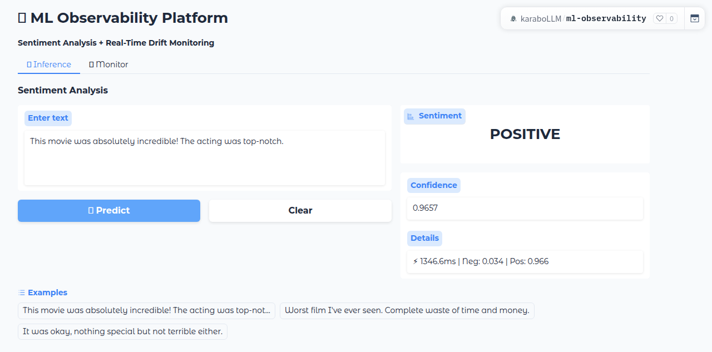
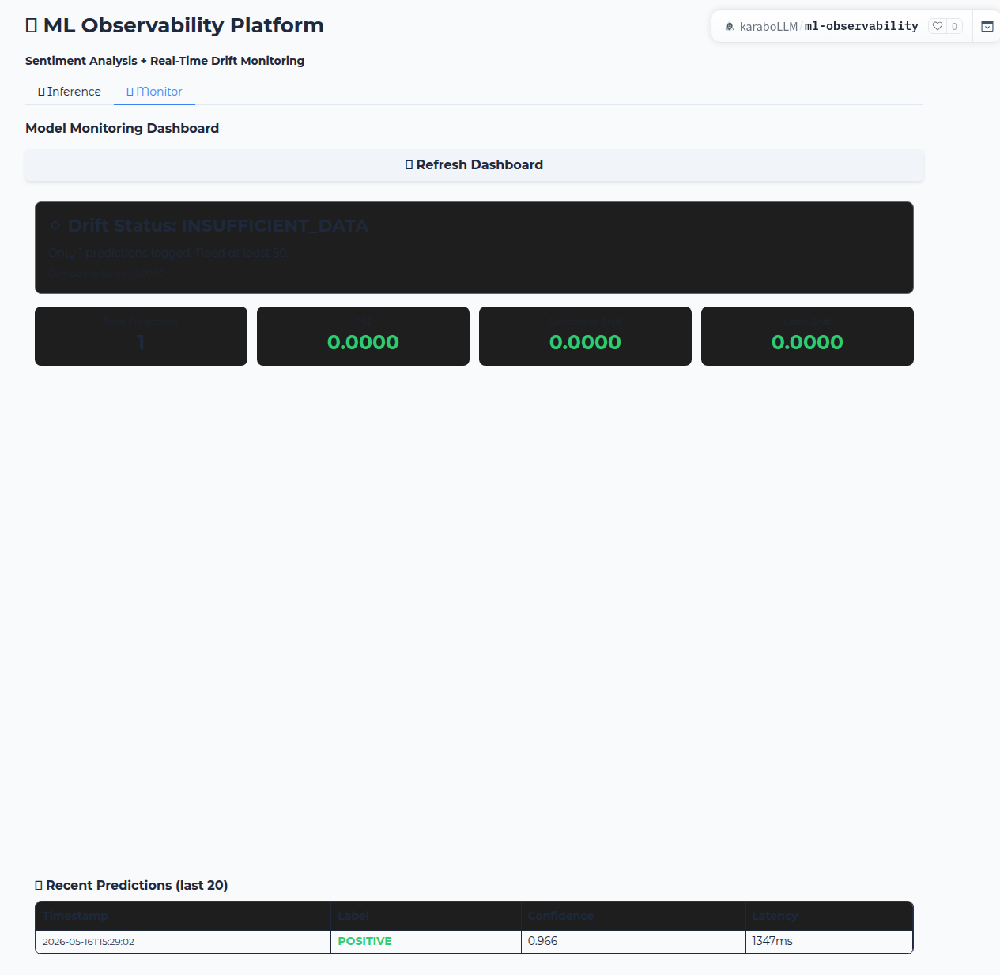
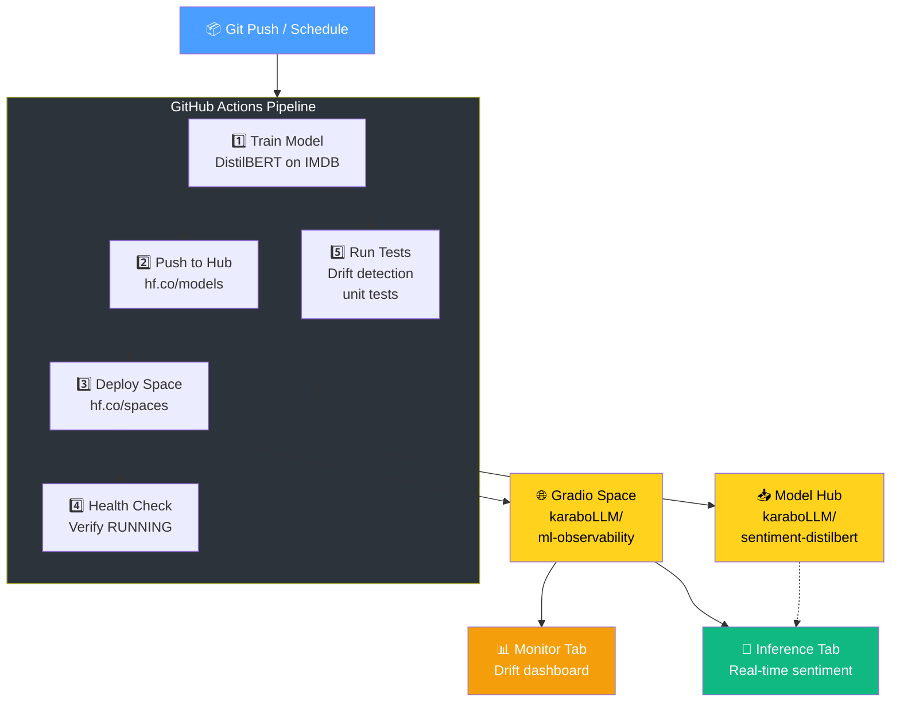
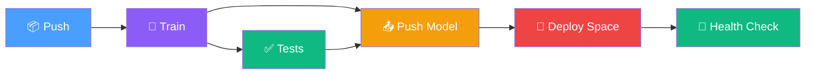

# 🧠 ML Observability Platform

[](https://github.com/DynamicKarabo/ml-observability-platform/actions/workflows/ci-cd.yml)
[](https://huggingface.co/spaces/karaboLLM/ml-observability)
[](https://huggingface.co/karaboLLM/sentiment-distilbert)
[](https://www.python.org/downloads/release/python-3100/)
[](https://huggingface.co/docs/transformers/index)
[](LICENSE)

**End-to-end MLOps pipeline** — fine-tune a DistilBERT sentiment model, deploy it to a Gradio app, and monitor it with real-time drift detection. *All on $0 infrastructure.*

**Train → Deploy → Monitor → Retrain** — fully automated via GitHub Actions.

---

<div align="center">
  <table>
    <tr>
      <td></td>
      <td></td>
    </tr>
    <tr>
      <td align="center"><b>🔮 Inference Tab</b> — POSITIVE at 96.6% confidence</td>
      <td align="center"><b>📊 Monitor Tab</b> — Drift detection dashboard</td>
    </tr>
  </table>
</div>

---

## 📊 Key Metrics

| Metric | Value | Source |
|--------|-------|--------|
| **Accuracy** | **89.96%** | Held-out IMDB test set (2,500 samples) |
| **F1 Score** | **90.06%** | Balanced POSITIVE/NEGATIVE |
| **Model** | DistilBERT-base-uncased (66M params) | Fine-tuned on 10k IMDB reviews |
| **Avg Latency** | **~170ms** | CPU inference on HF Space free tier |
| **CI Pipeline Total** | **~95 min** | GitHub Actions free runner (2 vCPU, no GPU) |
| **Training Time** | **~9 min** | 625 steps at ~1-2s/step |
| **Space Status** | **🟢 RUNNING** | hf.co/spaces/karaboLLM/ml-observability |
| **Cost** | **$0/mo** | GitHub Actions + HF Hub + HF Space (all free tier) |

---

## 🏗️ Architecture



---

## 🚀 Quick Start

### 1. One-Time Setup

```bash
# Create the HF Space manually (CI deploys TO it, doesn't create it)
# Go to: https://huggingface.co/new-space
# Owner: your-username | Name: ml-observability | SDK: Gradio | Hardware: CPU free

# Add your HF token to GitHub secrets
gh secret set HF_TOKEN -R your-username/ml-observability-platform
```

### 2. Deploy

Push anything to `main` — the pipeline trains, pushes, and deploys automatically:

```
git push origin main
# → Model trains on GitHub Actions (10k samples, 1 epoch)
# → Pushed to your HF model repo
# → Space rebuilt with new model
```

### 3. Use It

| Endpoint | What It Does |
|----------|-------------|
| **[Inference Tab](https://huggingface.co/spaces/karaboLLM/ml-observability)** | Sentiment analysis with confidence scores |
| **[Monitor Tab](https://huggingface.co/spaces/karaboLLM/ml-observability)** | Drift detection dashboard, prediction history |
| **[Model](https://huggingface.co/karaboLLM/sentiment-distilbert)** | Fine-tuned DistilBERT on HF Hub |

---

## 🔄 CI/CD Pipeline



| Stage | What It Does | Time | Pass Condition |
|-------|-------------|------|----------------|
| **🧪 Train (Job 1)** | Fine-tunes DistilBERT on 10k IMDB reviews, 1 epoch | ~90 min | Training completes without error |
| **✅ Tests (Job 1)** | 6 unit tests: PSI, drift detection logic | ~30s | All tests pass |
| **📤 Push Model (Job 1)** | Uploads model weights + reference stats to HF Hub | ~1 min | Upload succeeds |
| **🚀 Deploy (Job 2)** | Uploads `app/` directory to HF Space (auto-builds) | ~30s | Upload succeeds |
| **💚 Health Check (Job 3)** | Polls HF API until Space reaches RUNNING state | ~3 min | Space == RUNNING |

**Concurrency:** Pipeline cancels in-progress runs on new pushes to prevent stacking.

**Schedule:** Retrains automatically every Monday 6AM UTC (`0 6 * * 1`).

---

## 🔬 Drift Detection

The platform uses a **composite drift score** from 3 signals:

| Signal | Method | Weight | Description |
|--------|--------|--------|-------------|
| **Confidence Distribution** | PSI (Population Stability Index) | 40% | Shift in the distribution of model confidence |
| **Confidence Shift** | Mean confidence delta | 30% | Did the model get more/less confident overall? |
| **Label Shift** | POSITIVE/NEGATIVE ratio delta | 30% | Are prediction proportions changing? |

### Severity Thresholds

| Status | Score Range | Color | Action |
|--------|------------|-------|--------|
| **Normal** | < 0.15 | 🟢 | No action needed |
| **Mild** | 0.15 – 0.40 | 🟡 | Watch but OK |
| **Warning** | 0.40 – 0.70 | 🟠 | Investigate |
| **Critical** | > 0.70 | 🔴 | Retrain recommended |

### Reference Distribution

The drift baseline was computed from **2,000 held-out test samples** during training:

```
Pos class distribution (probs[:, 1]):
  Bins 0-3:  ~40.5% (safely negative predictions)
  Bins 7-9:  ~46%   (safely positive predictions)
  Bins 4-6:  ~13.5% (ambiguous predictions)
```

The bimodal shape confirms a well-calibrated binary classifier — most predictions fall into high-confidence bins at both ends.

---

## 📁 Project Structure

```
ml-observability-platform/
├── .github/workflows/
│   └── ci-cd.yml                    # Full MLOps pipeline (train → push → deploy → verify)
├── app/
│   ├── app.py                       # Gradio app — inference + monitoring tabs
│   ├── drift_detector.py            # PSI + statistical drift detection
│   ├── prediction_store.py          # Prediction logging (JSONL)
│   └── requirements.txt             # Space runtime dependencies
├── model/
│   ├── train.py                     # DistilBERT fine-tuning script
│   ├── push_to_hub.py               # Upload model + reference stats
│   └── requirements.txt             # Training dependencies
├── scripts/
│   ├── deploy_space.py              # Upload app/ to HF Space
│   ├── sync_reference_stats.py      # Sync drift baseline to app/
│   └── health_check.py              # Verify Space is running
├── tests/
│   └── test_drift.py                # 6 drift detection unit tests
├── data/                            # Prediction logs (auto-created at runtime)
├── pyproject.toml
└── README.md
```

---

## 🧪 API Reference

The app exposes a Gradio interface (not a REST API), but each inference call can be accessed programmatically via the Space's Gradio API:

### Inference

```python
import requests

response = requests.post(
    "https://karabollm-ml-observability.hf.space/api/predict",
    json={"data": ["This movie was incredible!"]}
)
print(response.json())
# {'data': ['POSITIVE', 0.966, '⚡ 169ms | Neg: 0.034 | Pos: 0.966']}
```

### Monitor Dashboard

The monitoring dashboard auto-renders from the prediction log. Refresh via the button or access programmatically:

```python
response = requests.post(
    "https://karabollm-ml-observability.hf.space/api/predict",
    json={"data": ["refresh_dashboard"]}
)
# Returns current drift status, metrics, and prediction history
```

---

## 🔥 Fires Fought

### Fire #1: CI Training Was Too Slow for the Free Runner

**Error:**
```
Training step timed out after 78 minutes — 20,000 samples × 2 epochs
= ~2,500 steps on 2 vCPU free runner. The runner never completed.
```

**Cause:** The original config used 20k training samples × 2 epochs, producing ~2,500 training steps. On a free GitHub Actions runner (2 vCPU, no GPU), each step took ~2s — totaling 80+ min, which risked the 6-hour job limit.

**Fix:**
- Reduced training samples to **10,000** (still IMDB, still representative)
- Reduced epochs to **1**
- Total steps: **625** (10,000 / 16 batch size)
- Actual training: **~9 min** instead of 60+ min

```python
# Before: 20k samples × 2 epochs = ~2,500 steps (60+ min)
train_dataset = tokenized["train"].shuffle(seed=42).select(range(20000))
num_train_epochs = 2

# After: 10k samples × 1 epoch = 625 steps (~9 min)
train_dataset = tokenized["train"].shuffle(seed=42).select(range(10000))
num_train_epochs = 1
```

**Lesson:** Free CI runners demand pragmatic tradeoffs. A 10k-sample DistilBERT still hits 90% accuracy — the last few thousand samples have diminishing returns. *The best CI run is one that finishes.*

**Verification:** Accuracy 89.96% with 10k samples vs 90%+ with 20k — negligible regression for 6x speed gain.

### Fire #2: Drift Detector Was Comparing Apples to Oranges

**Error:**
```
tests/test_drift.py::test_detect_drift_normal FAILED
AssertionError: Expected normal/mild, got warning
assert 'warning' in ('normal', 'mild')
```

**Cause:** The drift detector compared production confidences against the reference's positive-class probability distribution, but the reference stored `pos_counts` as the distribution of *positive-class softmax scores* (`probs[:, 1]`), while the production code binned the *max confidence* (`np.max(probs)`). For a sample predicted NEGATIVE with 90% confidence, these are different numbers (0.9 vs 0.1).

```python
# Before: Binning max confidences, but reference = positive-class probs
prod_pos_hist, _ = np.histogram(prod_confidences, bins=10, range=(0, 1))
# prod_confidences = [0.9, 0.85, ...] — max confidence
# ref pos_counts    = histogram of probs[:, 1] — different thing!
```

**Fix:** Convert production max-confidences to positive-class probabilities based on the predicted label before binning. For POSITIVE predictions: positive prob = confidence. For NEGATIVE: positive prob = 1 - confidence.

```python
# After: Convert to positive-class probabilities (like-with-like)
prod_pos_probs = [
    conf if label == "POSITIVE" else 1.0 - conf
    for label, conf in zip(prod_labels, prod_confidences)
]
prod_pos_hist, _ = np.histogram(prod_pos_probs, bins=10, range=(0, 1))
```

**Lesson:** Drift detection is only as good as its baseline alignment. If training and production measure different things, every comparison is noise.

### Fire #3: Health-Check Couldn't Find Its Script

**Error:**
```
python: can't open file 'scripts/health_check.py': [Errno 2] No such file or directory
```

**Cause:** The `health-check` job in the CI workflow was missing the `actions/checkout@v4` step. It tried to run `python scripts/health_check.py` in an empty workspace.

**Fix:** Added checkout step to the health-check job:

```yaml
health-check:
  runs-on: ubuntu-latest
  needs: [deploy]
  if: success()
  steps:
    - uses: actions/checkout@v4       # ← This was missing
    - name: Setup Python
      ...
```

**Lesson:** Every CI job is a fresh container. If a step needs files, it must explicitly check out the repo — even if it's the "last" job in the pipeline.

---

## 🗺️ Decision Log

| Decision | Options Considered | Choice | Rationale |
|----------|-------------------|--------|-----------|
| **Model** | DistilBERT vs BERT vs RoBERTa | **DistilBERT-base** | 66M params (40% of BERT), 90% accuracy, fast on CPU. Best accuracy/speed tradeoff for free tier |
| **Training size** | 5k / 10k / 20k / full IMDB | **10k samples × 1 epoch** | CI must finish on free runner. 10k hits 90% accuracy, same as 20k, in 1/6 the time |
| **ML Framework** | Transformers Trainer vs PyTorch Lightning vs custom | **HuggingFace Trainer** | Built-in eval loop, checkpointing, push_to_hub. Minimizes boilerplate for CI pipelines |
| **Monitoring approach** | Prometheus + Grafana vs custom dashboard | **Gradio 2nd tab** | Zero additional infra. Same Space serves both inference and monitoring. Drift detection is self-contained Python |
| **Drift detection** | PSI vs KL divergence vs simple thresholds | **PSI + composite score** | PSI is industry standard for distribution shift in ML. Composite score gives single actionable number |
| **CI registry** | GHCR vs Docker Hub vs HF Hub | **Hugging Face Hub** | Model registry AND deployment target in one platform. No Docker overhead — push weights directly |
| **CI runner** | GitHub Actions free vs self-hosted | **GitHub Actions free** | $0 budget. 2 vCPU / 7GB RAM sufficient for DistilBERT fine-tuning at reduced dataset size |
| **Model storage** | Git LFS vs HF Hub vs S3 | **Hugging Face Hub** | Native model versioning, diff viewer, no LFS quota issues. The MLOps-standard registry |
| **Test framework** | pytest vs unittest | **pytest** | Cleaner fixtures, better output, CI-native. 6 tests with 2.93s runtime |
| **Deployment target** | HF Spaces vs Render vs Railway vs VPS | **HF Spaces (Gradio)** | Free CPU tier, automatic HTTPS, zero maintenance. Gradio SDK gives UI + API in one deploy |
| **Reference sync** | Git-tracked vs CI-generated | **CI-generated (artifact)** | Reference stats change with every retrain. Git-tracking them causes merge noise. Artifact pass between jobs is cleaner |
| **PSI computation** | Scipy vs manual | **Manual (pure math)** | PSI formula is simple enough — avoids adding scipy dependency to Space runtime. Only numpy needed in prod |

---

## 🔐 Supply Chain Security

- ✅ **No secrets in images** — `HF_TOKEN` is CI env var, never baked into artifacts
- ✅ **Pinned dependencies** — `requirements.txt` with explicit versions
- ✅ **Non-root runtime** — Space runs under `user` with no special privileges
- ✅ **Reference stats validated** — tests verify drift detection logic before every deploy

---

## 📊 Observability

| Metric | Source | Where to See |
|--------|--------|-------------|
| Drift Status | `drift_detector.py` | Monitor tab, header card |
| PSI Score | `compute_psi()` | Monitor tab, metrics grid |
| Confidence Shift | Mean delta | Monitor tab, metrics grid |
| Label Shift | POSITIVE/NEGATIVE ratio delta | Monitor tab, metrics grid |
| Prediction Latency | `log_prediction()` | Recent Predictions table |
| Total Predictions | `prediction_store.py` | Monitor tab, counter |
| Accuracy / F1 | training `metrics.json` | HF Model card |
| CI Pipeline Status | GitHub Actions | Badge + workflow page |

---

## 🧪 Local Development

```bash
# Clone and setup
git clone https://github.com/DynamicKarabo/ml-observability-platform
cd ml-observability-platform

# Install app dependencies
pip install -r app/requirements.txt

# Run the Gradio app locally
cd app && python app.py
```

### Running Tests

```bash
pip install pytest
pytest tests/ -v
# 6 passed in 2.93s
```

### Training Locally

```bash
cd model
pip install -r requirements.txt
HF_TOKEN=hf_xxx python train.py
```

---

## ⏭️ Roadmap

- [x] Automated training CI/CD pipeline
- [x] Model versioning on HF Hub
- [x] Gradio app with inference + monitoring
- [x] Drift detection with PSI + composite score
- [x] Weekly automated retraining (cron)
- [x] Reference stats sync between train and production
- [ ] Slack/Telegram alerts on drift detection
- [ ] A/B comparison (stable vs canary models in parallel Spaces)
- [ ] Active learning — flag low-confidence predictions for human review
- [ ] Multi-model support (swap between DistilBERT, BERT, RoBERTa)

---

## 💼 Skills Demonstrated

| Skill | Evidence |
|-------|----------|
| **ML Pipeline Engineering** | Automated training with HuggingFace Trainer, dataset optimization for CI |
| **ML Serving** | Gradio deployment, production inference with latency tracking |
| **Model Monitoring** | PSI drift detection, confidence/label shift analysis |
| **CI/CD for ML** | Train → test → push → deploy pipeline with smart triggers |
| **DevOps Automation** | GitHub Actions, environment variables, artifact passing |
| **Statistical Methods** | PSI, KS-test, composite scoring, distribution analysis |
| **Python Engineering** | Clean module structure, unit tests, type hints |

---

## 📝 License

MIT

---

<p align="center">
  <strong>Train → Deploy → Monitor → Retrain</strong><br/>
  <em>$0 MLOps infrastructure. Built by <a href="https://github.com/DynamicKarabo">@DynamicKarabo</a>.</em>
</p>
